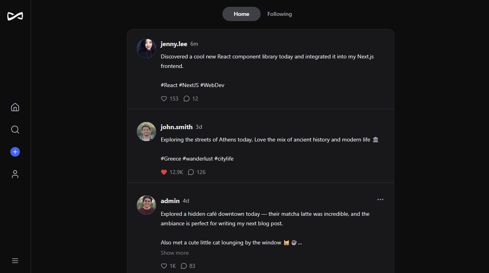
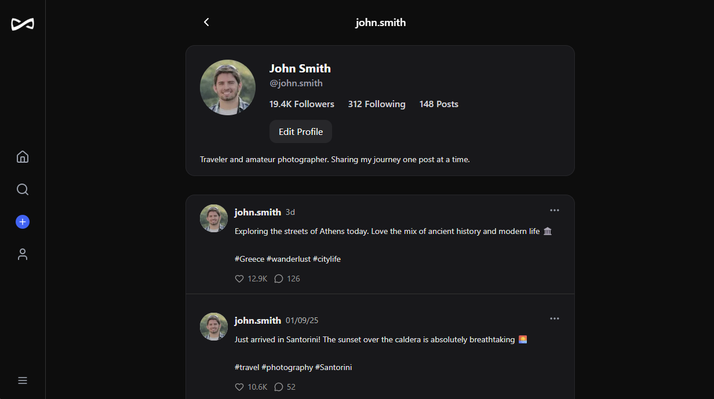
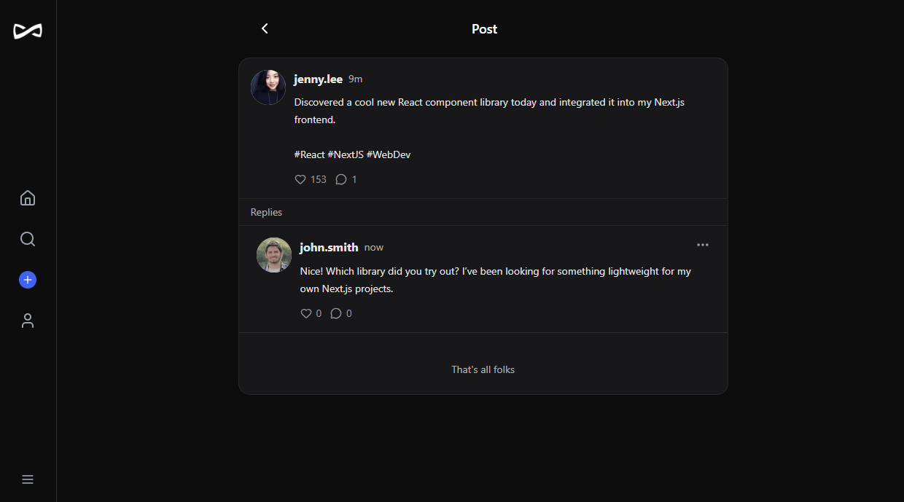
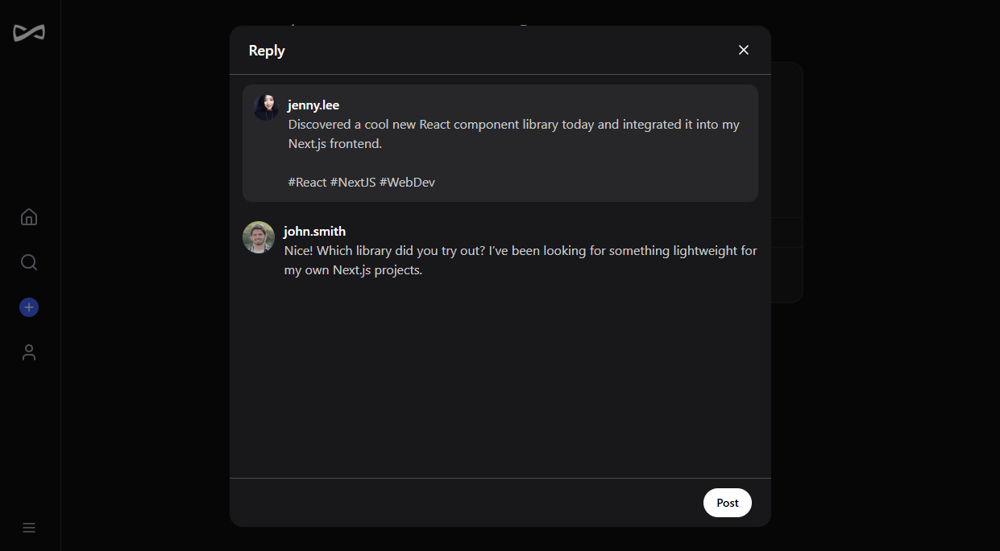
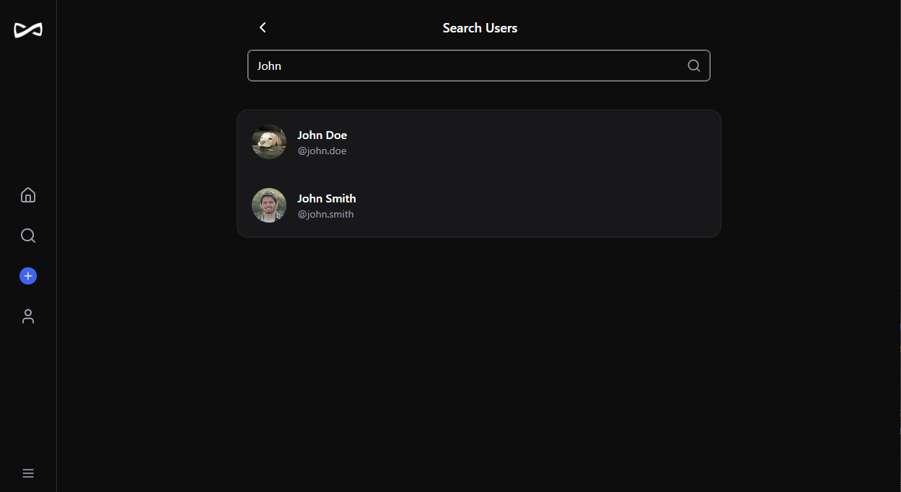
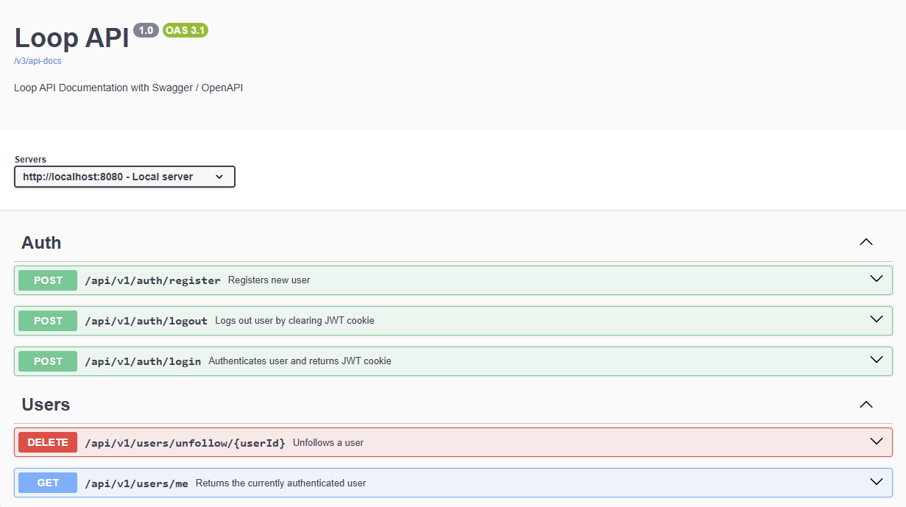

# Loop - Thread Application

     

**Description:**
A full-stack social media platform with a Spring Boot backend and Next.js frontend. Users can create posts, reply, like, follow/unfollow, and browse feeds. The backend uses PostgreSQL for persistence and demonstrates service-layer design and DTO mapping.

## Features

-   User registration, login, and logout.
-   Create, reply to, and delete posts.
-   Like/unlike posts.
-   Follow/unfollow users.
-   Pagination and filtering for posts (by author, followed users, or parent post).
-   Clean separation between backend services, DTOs, and frontend components.
-   Backend documentation via SpringDocs

## Technologies

-   **Backend:** Java, Spring Boot, Spring Data JPA, Spring Security
-   **Frontend:** Next.js, React, Tailwind CSS
-   **Database:** PostgreSQL
-   **Authentication:** JWT tokens, HttpOnly cookies
-   **Build Tools:** Gradle (backend), Node.js/NPM (frontend)

## Setup Instructions

### 1. Clone the repository

```bash
git clone https://github.com/klenarczyk/loop-showcase.git
cd loop-showcase
```

### 2. Backend Setup (Spring Boot)

1. Navigate to the backend directory:

```bash
cd backend
```

2. Copy the template properties file and update the fields mentioned in step 3.

```bash
cp src/main/resources/application.properties.example src/main/resources/application.properties
```

3. Configure your `application.properties`:

```properties
# Database configuration
spring.datasource.url=jdbc:postgresql://localhost:5432/<YOUR_DB_NAME>
spring.datasource.username=<YOUR_DB_USERNAME>
spring.datasource.password=<YOUR_DB_PASSWORD>

# Security configuration
jwt.secret=<YOUR_JWT_SECRET>
```

4. Build and run the backend:

```bash
./gradlew build
./gradlew bootRun
```

The backend will be accessible at `http://localhost:8080`.
The documentation will be accessible at `http://localhost:8080/swagger-ui/index.html`

### 3. Frontend Setup (Next.js)

1. Navigate to the frontend directory:

```bash
cd ../frontend
```

2. Install dependencies:

```bash
npm install
```

3. Copy the template .env.local file and update the fields mentioned in step 4.

```bash
cp ./.env.example ./.env.local
```

4. If any default backend values have been changed reflect those changes in the .env.local

5. Start the development server:

```bash
npm run dev
```

The frontend will be accessible at `http://localhost:3000`.

## Known Issues

-   Deleting a user may leave follower/following counts and like/reply counts temporarily inconsistent. A future refactor will compute counts dynamically in the service layer.

## Usage

-   Sign up and log in.
-   Create posts or reply to existing posts.
-   Like posts and follow other users.
-   Search for users to follow
-   Browse feeds with pagination.

## Screenshots

### Feed Page



### Profile Page



### Post Repies



### Reply Composer



### Search Page



### Backend Documentation


